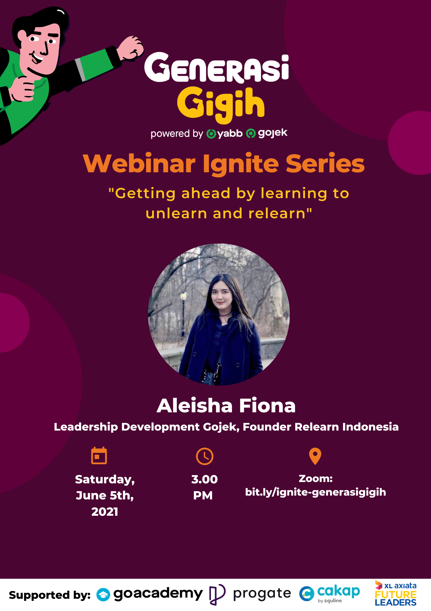

## Background Story

Back in April 2021, I haven’t got any job yet after graduating from Vocational High School. By the end of the month, I found a really interesting post on LinkedIn which stated that Yayasan Anak Bangsa Bisa (under Gojek) is opening a program called Generasi GIGIH. Generasi GIGIH was addressed for those who have graduated high school, university, or a final year university student. They gave us 3 main learning path, which is: Backend Engineering, Frontend Engineering, and Data Analyst path.

The program caught my interest at the first glance, and I’m intended to apply for the Backend Engineering program as soon as possible. The requirements are quite simple, you only need to send your updated CV, motivation letter, take an English test at Cakap, and also apply directly via Kalibrr. Since I already have a CV, I just need to write a motivation letter. This is the hardest part for me because I’m not quite good at writing that kind of thing, especially they wanted us to write it in Bahasa Indonesia. But in the end, after spending around 4 hours, finally I finished the motivation letter.

The last step that I need to do is, wait. Just wait until they announce the people that going to continue into the next step. And after waiting for about a week, I got an e-mail which told me that I have passed to join the Beginner Level of this program.

## Learning Journey

At the beginner level, we were given access to some online learning platforms, such as Progate, Cakap, and XL Online Learning Platform. Because I took the Backend Engineering path, I have to finish some required modules from the program. The required modules are Git, Ruby, HTML & CSS, and also SQL. For Cakap, it’s basically just some modules that consist of some topics within Software Engineering. XL Online Learning Platform gave us 9 classes about developing our soft skills.

I don’t meet any hard obstacles within this level, because basically we just need to finish those classes within the time given. The main problem is managing our time to fulfill the required class within the time limit. I could easily do this just by spending an hour each day. I finished all of the required classes at H-4 of the deadline.

## Additional Event: Webinar Ignite Series

### Webinar #1: Getting ahead by learning to unlearn and relearn

The first one is a webinar by Aleisha Fiona, Leadership Development Gojek & Founder of Relearn Indonesia. The main topic is about learn, unlearn, and relearn; a simple term which I’m sure that all of us must’ve heard about a lot of times. She talks about how important it is to have a growth mindset for a person in this current time. And she explains about learn, unlearn, and relearn very easily.

Basically, learning is a process when we find out about something new for us, unlearn is a process to “delete” that information which we already know from the learning process, and relearn is simply a learning process that we do after the unlearning process. Unlearn and relearn is a quite useful process, where we remove all of the obsolete information from our memories and change that information with new information.

### Webinar #2: Self Learning 101 for Tech Talent

The second one is a webinar by Opan Mustopah, System Engineer at GoPay. Opan talks about the learning process in the tech industry. This is an important topic to covered because, in my experience, the tech industry is a fast-moving industry, where the skill-set that we have now might become obsolete in a matter of months, or weeks. So, learning is a highly important activity that we should have every day.

Opan shares some tips for those of you who wanted to dive into the tech industry. The tips are:

 1. Pick your goal and interest

 2. Learn just enough

 3. Try and practice

 4. Repeat the first and second steps, + commitment

 5. (Optional) Freelance

### Webinar #3: What to Prepare to be a Change Maker

The last webinar from Generasi GIGIH is a webinar by Kevin Aluwi, Co-Founder and CEO of Gojek. In this webinar, Kevin taught us a lot of lessons from the early life of Gojek. There are a lot of obstacles when we are trying to build something new. We might hear a lot of perceptions and negative thoughts from others, but we need to focus on our main goals.

Based on the topic of this webinar, Kevin also shares some tips on how to become a change maker. The main point is we only need to start by doing some little things in our life. When we already achieve those things, we could broaden our goals.

---

Okay, so that’s just it. I hope you guys find something useful in this post. Cheers!
